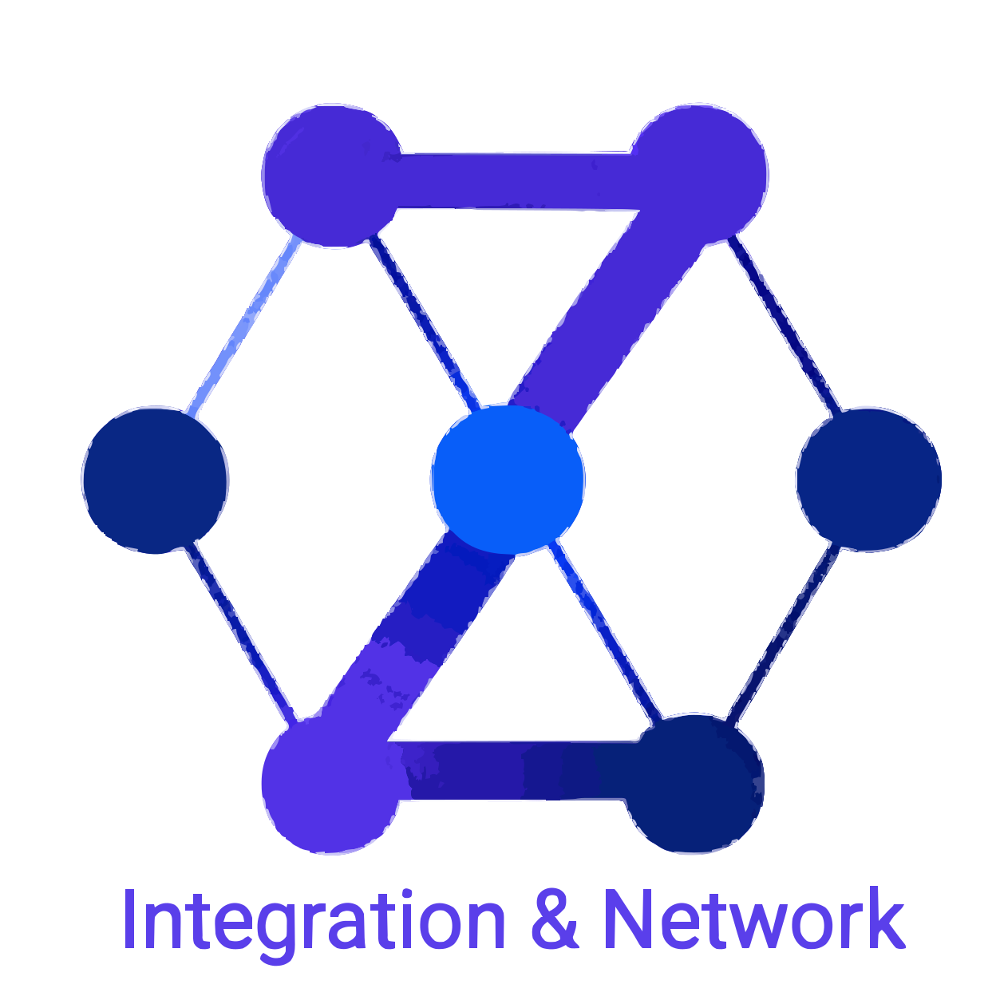

# Ziri Technologies

### Engineering intelligent systems that connect, understand, and evolve.

Ziri Technologies builds enterprise integration solutions, intelligent
automation, and experimental AI systems for complex engineering environments.

[Website](https://ziri-tech.com) ·
[LinkedIn](https://www.linkedin.com/company/ziri-technologies) ·
[Contact](mailto:hello@ziri-tech.com)

---

## What we engineer

### Enterprise Integration

Connecting applications, platforms, data, and business processes through
reliable integration architectures built for long-term evolution.

### AI Engineering and Automation

Applying AI, agents, local language models, and intelligent automation to
engineering problems where context and reliability matter.

### Developer Productivity

Building tools and systems that help engineering teams understand complex
software, reduce repetitive work, and make better technical decisions.

## Ziri Labs

Ziri Labs is where we explore emerging approaches to intelligent engineering
systems.

- **Context-Aware Code Intelligence** — Prototype
- **Integration Modernization Agents** — Research track

Experiments and public repositories will be shared here as they mature.

## Why Ziri?

The name **Ziri** is inspired by the transition from the first generation of
digital assistants to a new era of context-aware AI assistance.

Where early assistants helped people perform simple everyday tasks, Ziri
explores how intelligent systems can assist engineers in understanding,
connecting, modernizing, and evolving complex software environments.

Ziri represents assistance for the AI engineering era.

## Engineering principles

- Context before automation.
- Architecture before acceleration.
- Human judgment remains central.
- Build for evolution.

## About

Ziri Technologies is an engineering-first company based in Bengaluru, India.

Established in 2026 and built on nearly two decades of enterprise integration
experience, Ziri combines practical engineering expertise with focused
experimentation in AI-powered software systems.

---

**Building intelligent software systems.**

[Explore Ziri Technologies](https://ziri-tech.com)

